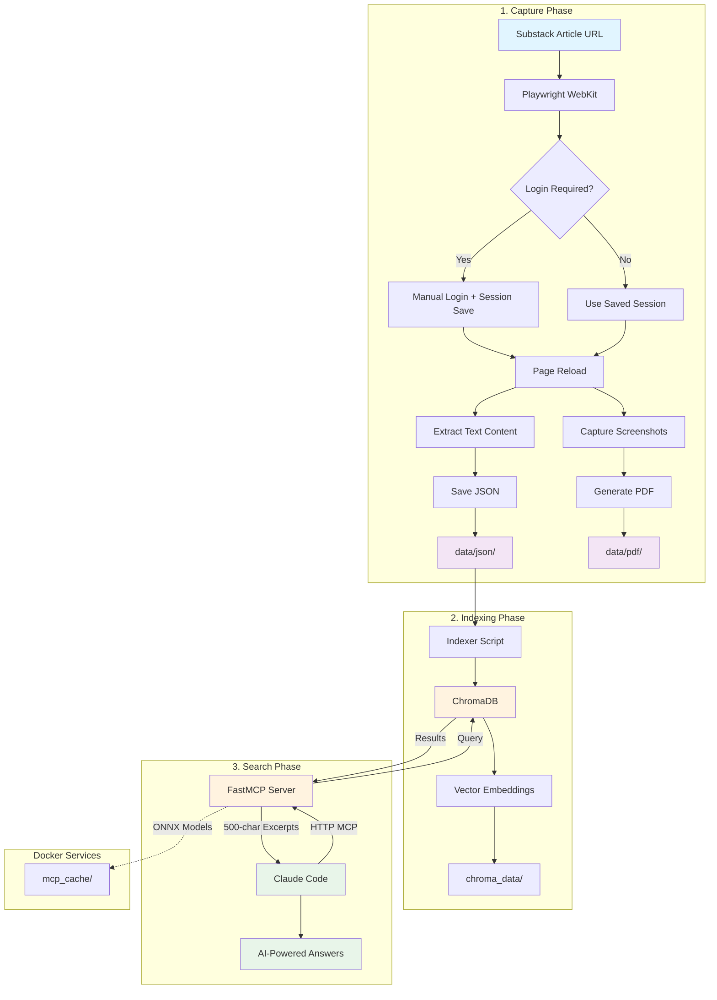

# Substack Newsletter Archiver + MCP Search

Capture your subscribed Substack newsletters as paginated PDFs and search them via Claude Code using MCP!

## Architecture



## Features

### PDF Capture
- Uses Safari's webkit engine for native rendering
- Automatically scrolls and captures page-by-page
- Creates properly paginated PDFs (each screenshot = 1 PDF page)
- Perfect for long newsletters - easy to read and navigate
- Auto-generates filename from URL
- Persistent login session (no repeated logins!)
- Extracts full text content even from paywalled articles
- All PDFs saved to `data/pdf/` folder
- Text content saved to `data/json/` for search indexing

### Smart Search via Claude Code MCP
- Semantic search using ChromaDB vector database
- MCP (Model Context Protocol) server integration
- Ask questions about your archive directly in Claude Code
- Returns concise 500-character excerpts (no token waste on PDFs!)
- Docker-based setup for easy portability
- HTTP MCP server on localhost:8001

## Setup

### 1. Install Dependencies

```bash
# Install uv (if not already installed)
curl -LsSf https://astral.sh/uv/install.sh | sh

# Install project dependencies
uv sync
```

### 2. Install Playwright Browser

```bash
uv run playwright install webkit
```

### 3. Start Docker Services

```bash
# Start ChromaDB and MCP Server
docker-compose up -d

# Verify services are running
docker ps
```

You should see:
- `substack-chromadb` on port 8000
- `substack-mcp-server` on port 8001

### 4. Configure Claude Code

Add to your `~/.claude.json`:

```json
{
  "mcpServers": {
    "substack-search": {
      "type": "http",
      "url": "http://localhost:8001/mcp"
    }
  }
}
```

Then restart Claude Code to load the MCP server.

## Usage

### Capturing Articles

**First time (with subscription/login):**
```bash
uv run archiver/capture.py "https://example.substack.com/p/article" --login
```

- Browser opens showing the article
- Log in to Substack manually if needed
- Press ENTER in terminal to continue
- PDF saved to: `data/pdf/article.pdf`
- JSON saved to: `data/json/article.json` (for search)

**After first login (session saved):**
```bash
uv run archiver/capture.py "https://example.substack.com/p/your-article"
```

- No login needed - uses saved session!
- PDF auto-saved to `data/pdf/your-article.pdf`
- JSON auto-saved to `data/json/your-article.json`

**Custom filename:**
```bash
uv run archiver/capture.py "https://example.substack.com/p/article" -o my_custom_name.pdf
```

**Headless mode (no browser window):**
```bash
uv run archiver/capture.py "https://example.substack.com/p/article" --headless
```

### Indexing for Search

After capturing articles, index them into ChromaDB:

```bash
# Convenience script (recommended)
./index.sh

# Or direct command
uv run archiver/indexer.py
```

This will:
- Load all JSON files from `data/json/` directory
- Index them into ChromaDB for semantic search
- Show progress and stats

### Searching Your Archive

**In Claude Code:**

Once the MCP server is running and configured, simply ask Claude Code:

```
Search my substacks for "polars"
```

or

```
What did the author say about DuckDB?
```

Claude Code will use the MCP server to search your indexed articles and provide answers with citations!

**Direct API Testing (optional):**

```bash
# Health check
curl http://localhost:8001/health_check

# Test the MCP endpoint
curl http://localhost:8001/mcp
```

## Folder Structure

```
substack-archiver/
├── README.md                        # This file
├── docker-compose.yml               # Docker orchestration
├── .gitignore                       # Git ignore rules
├── pyproject.toml                   # Python project config (uv)
├── uv.lock                          # Dependency lock file
├── capture.sh                       # Convenience script for capturing
├── index.sh                         # Convenience script for indexing
│
├── archiver/                        # Capture + indexing
│   ├── capture.py                   # Playwright capture script
│   └── indexer.py                   # Index JSON to ChromaDB
│
├── mcp/                             # FastMCP server
│   ├── server.py                    # FastMCP HTTP server
│   └── test_api.py                  # API tests
│
├── slack-agent/                     # ADK agent + Slack integration
│
├── data/                            # Generated data
│   ├── pdf/                         # PDF screenshots
│   └── json/                        # Text + metadata for search
├── chroma_data/                     # Generated: ChromaDB vector database
├── mcp_cache/                       # Generated: ONNX model cache
└── .playwright_session/             # Generated: Browser session
```

## How It Works

### 1. Capture Phase
1. Playwright opens the article in Safari (webkit)
2. If `--login` flag is used, pauses for manual login
3. After login, page is reloaded to ensure full content access
4. Text content is extracted from the DOM (bypasses paywalls!)
5. Page is captured as screenshots (viewport-by-viewport)
6. Screenshots are combined into a paginated PDF
7. Text and metadata saved as JSON for indexing

### 2. Indexing Phase
1. Indexer script reads all JSON files from `data/json/`
2. Each article is embedded using ChromaDB's default embedding function
3. Vectors are stored in ChromaDB (`chroma_data/` directory)
4. Ready for semantic search!

### 3. Search Phase
1. Claude Code connects to MCP server via HTTP (localhost:8001)
2. User asks a question in Claude Code
3. Claude Code calls the `search_substacks` tool
4. MCP server queries ChromaDB for relevant articles
5. Returns 500-character excerpts (not full documents!)
6. Claude Code uses excerpts to answer the question
7. PDF paths provided for reference only (not read by AI)

## Login Session Management

- **First run with `--login`**: Browser opens, you log in manually, press ENTER
- **Login session saved** in `.playwright_session/` folder
- **Future runs**: automatically uses saved session (no login needed!)
- **Session persists** until you clear it or cookies expire
- **Page reload after login** ensures full content extraction (bypasses paywall)

## Docker Services

### ChromaDB (Port 8000)
- Vector database for semantic search
- Data persists in `chroma_data/` directory
- Accessible at `http://localhost:8000`

### MCP Server (Port 8001)
- FastMCP HTTP server for Claude Code integration
- Semantic search tool: `search_substacks`
- Health check: `http://localhost:8001/health_check`
- MCP endpoint: `http://localhost:8001/mcp`
- ONNX model cache in `mcp_cache/` directory

## Docker Commands

```bash
# Start services
docker-compose up -d

# View logs
docker-compose logs -f mcp-server
docker-compose logs -f chromadb

# Restart MCP server (after code changes)
docker-compose restart mcp-server

# Stop services
docker-compose down

# Remove everything (including data)
docker-compose down -v
rm -rf chroma_data/ mcp_cache/
```

## Tips

### PDF Capture
- Run script from project root directory
- PDFs automatically save to `data/pdf/` folder
- JSONs automatically save to `data/json/` folder
- If page has lazy loading: Increase `wait_for_timeout` value in script
- For better quality: Adjust `resolution` parameter in script
- Always use `--login` for first-time capture of paywalled content

### Search Engine
- Run `./index.sh` after capturing new articles
- ChromaDB data persists in `chroma_data/` directory
- MCP server restarts automatically (unless stopped)
- Excerpts are limited to 500 chars to save tokens
- PDF paths are reference-only (not read by AI)

### MCP Integration
- MCP server must be running before using Claude Code
- Restart Claude Code after config changes
- Check logs if tool doesn't appear: `docker-compose logs mcp-server`
- Health check to verify server: `curl http://localhost:8001/health_check`

## Troubleshooting

### MCP Server Not Appearing
```bash
# Check if server is running
docker ps | grep mcp-server

# Check logs
docker-compose logs mcp-server

# Restart server
docker-compose restart mcp-server

# Restart Claude Code
```

### Collection Not Found Error
```bash
# Run indexer to populate ChromaDB
./index.sh
```

### Connection Refused
```bash
# Start services
docker-compose up -d

# Wait 10 seconds, then check
curl http://localhost:8001/health_check
```

### Paywall Content in JSON
Make sure to:
1. Use `--login` flag on first capture
2. Wait for page to fully load after login
3. Script automatically reloads page after login to get full content

## Future Enhancements

- [ ] Web UI for search
- [ ] Batch capture from Substack feed
- [ ] Export search results
- [ ] Support for other newsletter platforms
- [ ] Configurable excerpt length
- [ ] Multiple ChromaDB collections

## MCP Tool Reference

### search_substacks
**Description**: Search your Substack newsletter archive for relevant articles

**Parameters**:
- `query` (str): Search query (natural language question or keywords)
- `n_results` (int): Number of results to return (default: 3, max: 10)

**Returns**: Formatted search results with:
- Article title, author, date, URL, PDF path
- 500-character excerpt from each article
- PDF paths are for reference only - DO NOT read them

**Example**:
```
Search my substacks for "vector databases"
```

## Technology Stack

- **Playwright**: Browser automation (Safari/webkit)
- **Pillow**: Image processing for PDF generation
- **ChromaDB**: Vector database for semantic search
- **FastMCP**: MCP server framework
- **Docker**: Containerization for services
- **uv**: Fast Python package manager
- **Claude Code**: AI-powered coding assistant with MCP support
